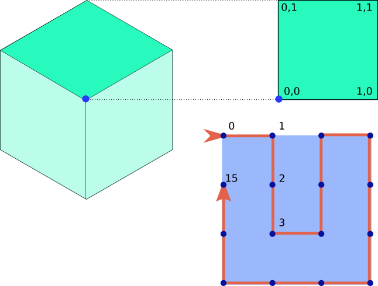

# How the image is created

## Colors and misc

First, the **input string** to is hashed with [sdbm](http://www.cse.yorku.ca/~oz/hash.html) to get an integer.
For example, `sdbm("Hello world.") -> 860116106`.  The *binary representation* (e.g. `110011010001000101010010001010`) is used for the algorithm moving forward.

The two **colors** are chosen by using *5-bit chunks* (e.g. 32 choices) for each R, G, and B value.  Thus, two RGB colors require 30 (5 * 3, twice) bits.  From the example bits, one color would come from: `10101,00100,01010`.  Finally, the 7th bit (why not?) is used to determine if the image should be flipped vertically.  (Basically "the other" orientation.)

## Drawing the polygon

If the hexagon is imagined to be an *isometric cube* (below, left), one "square" side is used to draw the shape.  This side is mapped as a unit square, with the origin (0,0) at the center of the hexagon (blue dot below).

This unit square is mapped evenly into 16 points, incrementing by 1/3 unit, as shown in the lower right.  The *red line* shows the *ordering* the points are traversed.  Based on the bits from the input hash, a *polygon* is created, using points where the bit is set.  From the example value, the final sixteen bits `0101010010001010` means the polygon would include points 1, 3, 7, 10, 12, and 14.

This *polygon* (once transformed to fit the skewed isometric side) is added to the **svg**.  The same polygon is rotated to cover the remaining two "sides" of the isometric cube as well.

